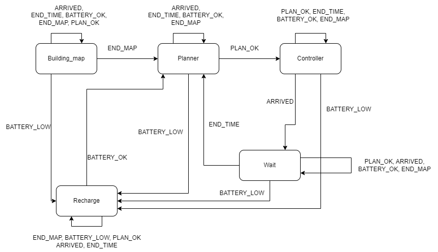
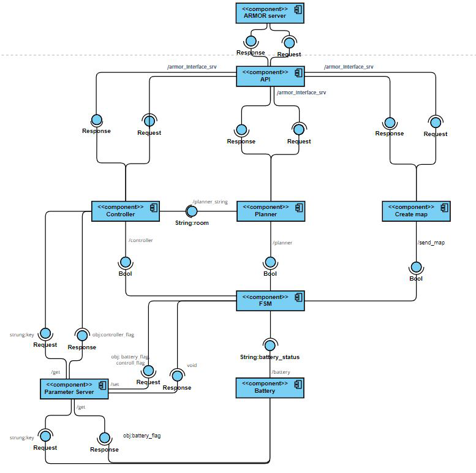

# Exprolab Assignment 1 Limone Marco
## Aim of the Assignment
For this assignment we have to simulate the presence of a robot in an indoor environment created through ontology. Through the use of a state machine and external nodes, the robot must be able to move around the various rooms, preferring the most urgent ones and always trying to stay in the corridors after being in a room.

##

## Installation and running procedures
For the dowload and installation of this assignment the user need to go in the *src* folder of his workspace and use the following command:
- git clone https://github.com/marcolimone/Exprolab.git

Then you need to substiutte the armor_py_api folder presento in the armor folder, with the one present in the repository because some function were added and used in the scripts 

In the end to run the code you need to run a launch file, present in the launch folder of the publishers folder, that start all the node and the state machine:
- roslaunch publishers nodes_launcher.launch 

Note that in the publishers folder there are also some simple subscriber to test individually the nodes.
In the node's script there are some commented line that are used to debug the code.

## Structure of the code
In this section, the diagram related to the structure of the FSM and the Component Diagram are presented. Also in the repository there is an explanatory video of the operation: *behaviour_video.gif*.

### FSM structure

### Component Diagram

## Working hypothesis and environment
### System’s features and assumption
The state machine has been designed on 5 states:
- Send Map: state that runs only once at the beginning. In this state the state machine waits for the map to be created in the ontology, as soon as the ontology is       completed, the state machine will receive the message *end_map* will allow the transition to the next state.
- Planner: in this state the state machine waits until the planner decides which room to reach next. Once the room has been chosen, the state machine will receive the *chosen_room* message which will allow the transition to the next state.
- Controller: the controller state has been designed to simulate the movement of the robot from one room to another (the actual movement is actually instantaneous). When the state machine gets the *arrived* message, it will change the state.
- Wait: in the wait state it simply waits for the time when the robot stops in the room just reached to end.
- Recharge: the state machine moves into this state to allow the robot to recharge before it discharges. This state can be reached from any other state (except the send_map state) when the *battery_low* message arrives. This state is exited when the *battery_ok* message arrives.

The state machine is a part of the architecture. It is supported by four nodes that send messages that the state machine will manage:
- Create map node: this node is conteined in the *create_map_pub.py* file and is used to create the map in the ontology. The map in the ontology is created by communicating with Armor via the API interface, in particular the relationships between rooms and doors are created, a disjoint is made to create individual individuals, the command is used to place the robot in a specific room and in the end a reason is made to validate all the relations just inserted.
- Battery low node: this node is contained in the *battery_low_publisher.py* file and is used for battery management. The battery is managed by a counter that decreases during the discharge phase and increases during the charge phase, with two different speeds (the discharge speed is faster than the charge one). Furthermore, when the counter (battery) falls below a certain treshold, a message is sent that will allow the state machine to enter the Recharge state to allow charging, when the battery is fully charged a message will be sent that will allow the state machine to exit from the charging status. The treshold is set to 20% of the battery so that the robot has the necessary battery to move into the charging room. The mode of the counter, increasing or decreasing, is managed by the flag *battery_flag*, taken from the parameter server, that is 1 in any state of the state machine, and is set to 0 only during the reload phase. The battery discharge time is set at around 3 minutes to make operation more realistic and allow the robot to make various movements before discharging. To speed up the discharge, just decrease the sleep time that simulates the discharge. 
- Planner node: planner node is managed by the *planner_pub.py* file. Here, through the API interface, the status of the robot and the ontology are queried: which are the reachable areas, of which are urgent. On the basis of the answers obtained, a room to be reached is chosen. After this choice has been made, two messages are published on two different topics, one boolean that will be read by the state machine and will be used to exit the Planner state, the other message contains the room to reach and will be read by the controller node.
- Controller node: controller node, managed by the *controller_pub.py* file, simulates the movement of the robot using a sleep. In this node, all the manipulations necessary for moving the robot from one room to another are made. This is done by communicating with Armor via the API interface, in particular the position of the robot in the ontology, and the timestamps of the robot and new room are changed. Finally, a message is published which will be used by the state machine to pass from the Controller state to the Wait state.

### Notes
- note on the visualization of the virtual machine: since the planner always has the plan ready, it often enters and exits the state very quickly, so as not to see the transition graphically. To have effective feedback on the transition to the planner state, just go and check the FSM terminal which displays the transitions that take place.

- note on the planner: when the robot is in charging mode the planner can't publish its plan before the battery is not fully charged, so it try to make a new plan every time, infact in its terminal we can see a lot of very quick messages for that. 

Some design choices were made on the basis of some assumptions:
- for the Wait node a node has not been made to manage the state, but everything is executed in the execute of the same because what happens in the Wait state does not need to be carried out also during other states, but only in the Wait state
- the battery management node sends the message continuously until the state machine enters the Recharge state, to prevent the message from being lost. The manage of the *battery_flag* is managed by the FMS to maintain a certain level of centralization and control by the FSM
- the same thing that happens for the battery low message also happens to the messages sent by the planner and controller, with the difference that in this case the messages will be taken into consideration only if the state machine is in the right state.
- another assumption made is that the robot can have info only on the neighboring rooms and therefore the planner can choose to reach only those that the query on the robot is on the canReach property returns.
- an assumption was also made on the request of the assignment relating to the ability of the robot to always return to the corridors after visiting a room. In this case, no specific care has been taken as the rooms are connected only with the corridors, so the latter are always the only environments reachable after being in a room.
- an important assumption was also made on the *create_map* node. The choice to make the node not very general and not open to various map configurations, is due to the fact that for the next assignment the robot will not have the map but will have to explore in search of information on the map, this means that the type of assembly of the map will be very similar to the one implemented in the aforementioned node, with the difference that the map will not be created completely at the beginning, but will be updated as the robot explores the environment.
- a final assumption is made on the management of planners and controllers. Both nodes communicate with the FSM via publisher/subscriber. The planner also publishes the room to be reached on a topic, and subsequently the controller reads this message without going through the FSM. This was done to make sure that the controller always has the last plan made by the planner. Furthermore, even if the data is always available, the controller performs its tasks only when the FSM enters the controller state and the *controller_flag* flag is raised, which allows the controller node to perform its tasks. In doing so, control remains in the hands of the FSM.

### System’s limitations
- a limitation may be the one already mentioned relating to the lack of generality of the node that creates the map, which as already said in the future may not be a limitation, but as regards this specific assignment it could be. In fact, having such a structured node would mean that every time you want to use a different map, you have to go and act on the script, or use another ready-made script with the different map (not optimal solution as it would mean having a file for each map).

### Possible technical Improvements
- a possible future improvement, especially linked to the next assignment, will be to modify the script related to the creation of the map to meet the needs of the next assignment, and consequently add transitions that from any state bring back to the node for the update of the map whenever the robot acquires information related to the map.
- another improvement could be related to the Recharge state, infact when the FSM is in this state, the robot go directly in the *E* room even if it is not an adjacent room to the current one. The improvement could be to make a path that the robot have to follow to reach the *E* room.
